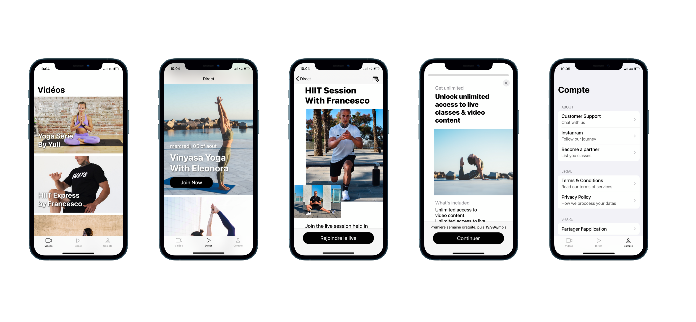

Sways 

This is Sways: a membership app to participate in live fitness classes and watch video contents. Build with Firebase, RevenueCat and Swift 5.2.
Here is how it look's like:

How to install the app? 

1. Create a new project at https://firebase.google.com and download the Google-info.plist 
2. Drag the Google-info.plist file inside the project folder
3. Go to the project directory and Run "pod install"
4. Create an account at https://www.revenuecat.com 
5. Create an entitlement ans subscription on RevenueCat
6. Copy/paste all the necessary datas from Revenue Cat inside the constants.swift file 
(private key, email/password, public key, entitlement ..). 
7. Run the App on Xcode!

About: 

This app has been created in early 2020 to offer to users a way to workout with trainers trought live video and video contents. 
It has been build on top of Firestore database, Firebase auth with Sign In with Apple has been used for authentification and RevenueCat & In-App purchase
for the subscription. 
